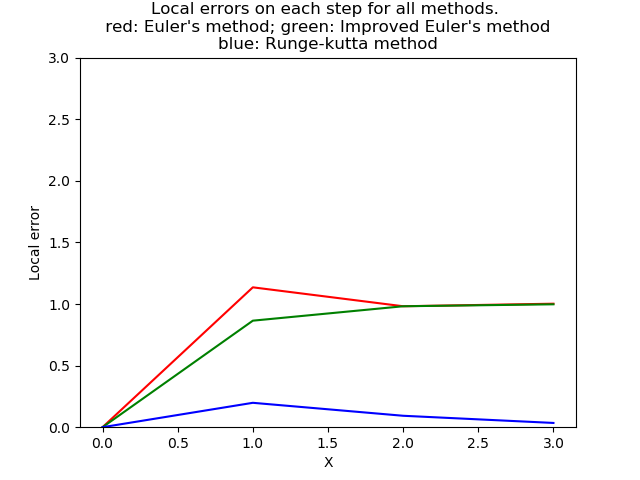

# Computational practicum

**Initial Value Problem**

```angular2html
y` = -2y + 4x
y(0) = 0 
x belongs to [0;X]
```
**Exact solution**
```
y = 2x - 1 + e^(-2x)
```


Programming assignment within the Differential Equations course in 
Innopolis University. The main purpose is to implement solution of given Initial 
Value Problem using methods of  numerical integration of differential equations with
different precisions. 
1. [Euler's method](https://en.wikipedia.org/wiki/Euler_method) O(h)
2. [Improved Euler's method](https://en.wikipedia.org/wiki/Heun%27s_method) O(h^3)
1. [Runge-Kutta method](https://en.wikipedia.org/wiki/Runge–Kutta_methods) O(h^4)

### Constructed solutions
Initial conditions can be changed in the header of [main.py](main.py)

```
# Initial conditions!
x0 = 0      # initial condition
y0 = 0
x_max = 3       # the rightmost bound
number_of_steps = 4
n_initial = 5       # minimal # of steps for plotting global errors
n_final = 30       # maximal # of steps for plotting global errors
```

Significant part of Euler's method implementation

`y[i] = step * f(x[i - 1], y[i - 1]) + y[i - 1]`

Significant part of Improved Euler's method implementation

```
k[0] = f(x[i - 1], y[i - 1])
k[1] = f(x[i - 1] + step, y[i - 1] + step * k[0])
y[i] = y[i - 1] + step / 2 * (k[0] + k[1])
```

Significant part of Runge-Kutta method implementation

```
k[0] = f(x[i - 1], y[i - 1])
k[1] = f(x[i - 1] + step / 2, y[i - 1] + step / 2 * k[0])
k[2] = f(x[i - 1] + step / 2, y[i - 1] + step / 2 * k[1])
k[3] = f(x[i - 1] + step, y[i - 1] + step * k[2])
y[i] = y[i - 1] + step / 6 * (k[0] + 2 * k[1] + 2 * k[2] + k[3])
```


### Local errors
Local error represents the difference between exact function and its 
approximates solution in the particular point.


### Global errors for different steps
Global error represents the maximal value of local error for the given grid size.


### Authors

Semen Kiselev, 2nd year Bachelor, Innopolis University
